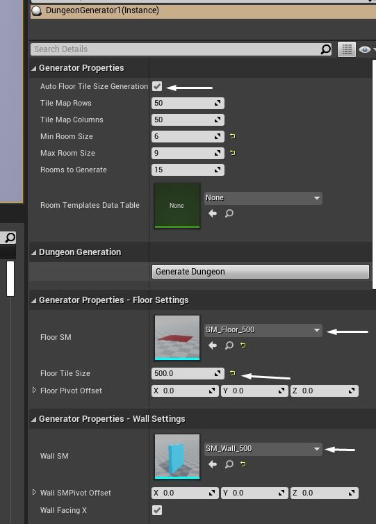
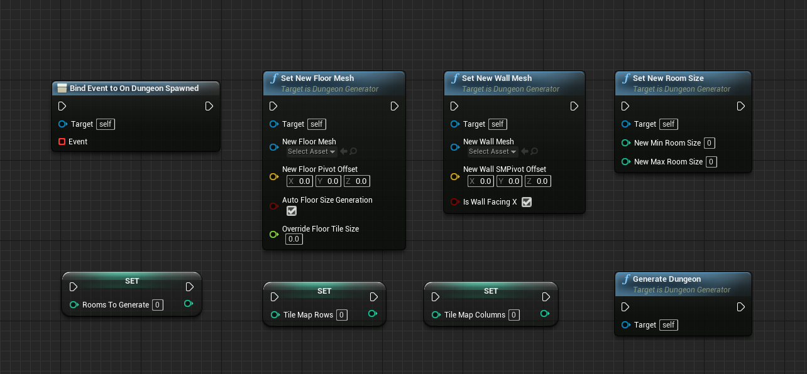

# DungeonGenerator
A (hopefully) handy Unreal Engine 5 Dungeon Generator

Read the full docs here: https://github.com/orfeasel/DungeonGenerator/blob/main/Docs/HowToUse.pdf

### TL;DR

- Place the dungeon generator in your level
- Assign a static mesh for your floor tiles to FloorSM
- Assign a static mesh for your walls to WallSM
- Click the generate dungeon button

### Available BP nodes

